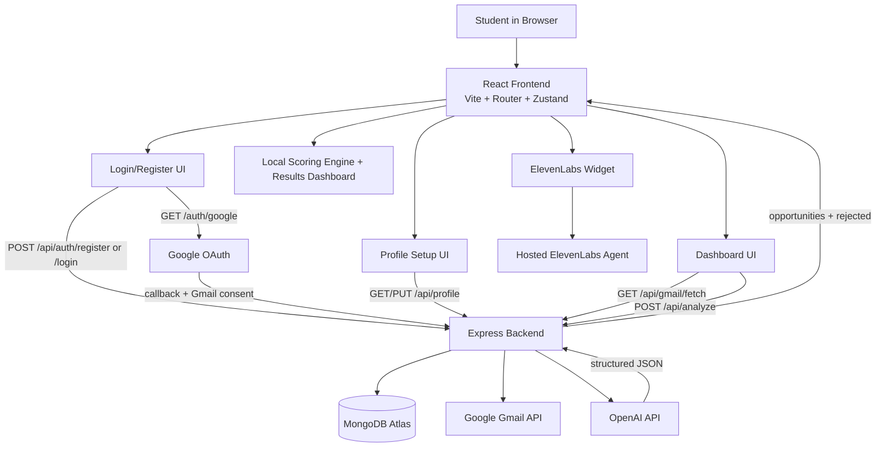

## Inbox Copilot Architecture

```text
                         +---------------------------+
                         |         Student           |
                         |  Browser on localhost     |
                         +-------------+-------------+
                                       |
                                       v
                         +---------------------------+
                         |     React Frontend        |
                         |  Vite + React Router      |
                         |  Zustand app store        |
                         +-------------+-------------+
                                       |
             +-------------------------+-------------------------+
             |                         |                         |
             v                         v                         v
 +----------------------+   +----------------------+   +----------------------+
 |  Auth Screens        |   |  Profile Setup       |   |  Dashboard           |
 |  Login/Register      |   |  Student profile     |   |  Paste emails        |
 |  Google sign-in      |   |  Save preferences    |   |  Upload PDF          |
 +----------+-----------+   +----------+-----------+   |  Fetch Gmail         |
            |                          |               |  Analyze results      |
            +------------+-------------+               +----------+-----------+
                         |                                        |
                         v                                        v
                +--------------------------------------------------------+
                |                 Express Backend                        |
                | /api/auth/*  /api/profile  /api/gmail/fetch  /api/analyze |
                +-------------+-------------------+----------------------+
                              |                   |
                              |                   |
                              v                   v
                    +------------------+   +----------------------+
                    |    MongoDB       |   |   Google OAuth +     |
                    | students/profile |   |   Gmail API          |
                    | JWT-linked users |   | fetch recent emails  |
                    +------------------+   +----------------------+
                                                    |
                                                    v
                                         raw email text returned
                                                    |
                                                    v
                +--------------------------------------------------------+
                |                OpenAI Analysis Layer                   |
                | Split emails -> send prompt -> return strict JSON      |
                | opportunities[] + rejected[]                           |
                +-------------------------------+------------------------+
                                                |
                                                v
                              +-----------------------------------+
                              | Frontend Ranking + Results UI     |
                              | Local scoring engine ranks items  |
                              | Shows priority, deadlines, fit    |
                              +-----------------------------------+

Separate assistant path:

React Frontend -> ElevenLabs widget script -> ElevenLabs hosted agent
                (profile/email context passed as dynamic variables)
```

## Mermaid Diagram



## Talk Track

- The frontend collects login, profile, and raw email input.
- The backend is the secure middle layer: auth, database access, Gmail fetch, and OpenAI calls all happen there.
- MongoDB stores users, profiles, and Google tokens.
- OpenAI extracts structured opportunities from raw email text.
- The frontend then scores and ranks those opportunities locally for presentation.
- ElevenLabs is a separate hosted voice/chat assistant embedded in the frontend.
